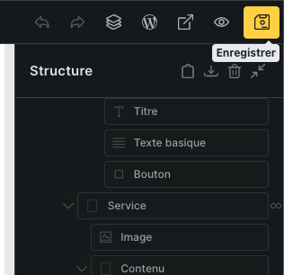

# Modification avec Bricks

Ce document a pour objectif de vous expliquer **les points essentiels à connaître pour modifier votre site WordPress construit avec Bricks**.  
Il est pensé pour une utilisation simple, sans connaissances techniques avancées.

---

## 1. Accéder à l’éditeur Bricks

1. Connectez-vous à l’administration WordPress  
2. Allez dans **Pages** (ou **Articles** selon le contenu)  
3. Passez la souris sur la page à modifier  
4. Cliquez sur **Modifier avec Bricks**

Vous arrivez alors dans l’éditeur visuel.

---

## 2. Comprendre l’interface Bricks

L’éditeur Bricks est composé de :
- **La zone centrale** : aperçu du site en temps réel  
- **Le panneau de gauche** : réglages de l’élément sélectionné  
- **La structure (Layers)** : hiérarchie des éléments de la page  

👉 **Astuce** : cliquez directement sur un élément du site pour le sélectionner.

---

## 3. Comment modifier un texte

1. Cliquez sur le texte à modifier dans la page  
2. Dans le panneau de gauche, restez sur l’onglet **Contenu**  
3. Modifiez le texte directement dans le champ prévu  
4. Le changement est visible immédiatement  

💡 Vous pouvez copier/coller du texte sans problème.

---

## 4. Modifier un bouton

1. Cliquez sur le bouton  
2. Onglet **Contenu** :
   - Modifier le texte du bouton  
   - Modifier le lien (URL)  
3. Onglet **Style** (si autorisé) :
   - Couleur  
   - Taille du texte  
   - Bordures  

⚠️ Évitez de modifier le style si vous n’êtes pas sûr, pour garder une cohérence graphique.

---

## 5. Modifier une image

1. Cliquez sur l’image  
2. Dans **Contenu > Image**  
3. Cliquez sur **Sélectionner une image**  
4. Choisissez une image depuis la médiathèque ou importez-en une nouvelle  

📌 **Conseil** : privilégiez des images légères (moins de 300–400 Ko).

---

## 6. Modifier un lien

Pour modifier un lien sur un texte ou un bouton :

1. Sélectionnez l’élément  
2. Dans **Contenu > Lien**  
3. Modifiez l’URL  

**Exemples :**
- Lien interne : `/contact`  
- Lien externe : `https://example.com`

---

## 7. Ajouter ou supprimer un élément (avec précaution)

### Ajouter un élément
1. Cliquez sur le bouton **+**  
2. Choisissez un élément (Texte, Image, Bouton…)  
3. Glissez-le dans la structure  

### Supprimer un élément
1. Sélectionnez l’élément  
2. Icône **corbeille** ou touche **Suppr**

  

⚠️ Attention : certaines sections sont liées à la mise en page globale.

---

## 8. Sauvegarder les modifications

- Cliquez sur **Enregistrer** en haut à droite  
- Attendez la confirmation avant de quitter la page  

💾 Les changements ne sont visibles pour les visiteurs qu’après sauvegarde.

---

## 9. Bonnes pratiques

- Modifier uniquement le **contenu**, pas la structure  
- Ne pas toucher aux réglages avancés (CSS, conditions, requêtes)  
- En cas de doute : demander avant de modifier  

---

## 10. Besoin d’aide ?

Si vous avez un doute ou un blocage, il vaut mieux demander plutôt que de risquer de casser la mise en page.

👉 Bricks est très puissant, mais certaines parties sont volontairement verrouillées pour garantir la stabilité du site.

---

*Document fourni pour faciliter l’autonomie du client sur les modifications simples du site.*